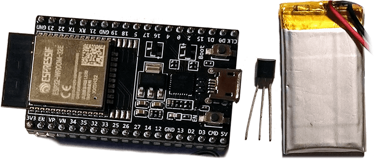
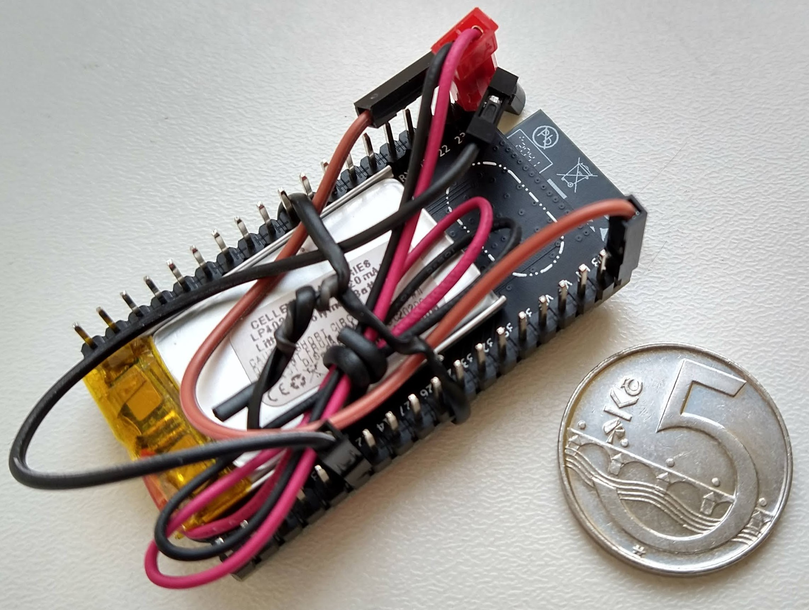

# ESP32 Wi-Fi Penetration Tool

This project implements attack on WPA/WPA2 handshake. 
It tries to get PMKID if AP provides it in plaintext during WPA authentication, otherwise it runs deauthentication attack and gather WPA handshake. 
Cracking of PMK from PMKID or handshake itself is not part of this project, as ESP32 doesn't have sufficient power to crash hashes in meaningful time period.

<p align="center">
    
</p>

## Build
This project is currently developed using ESP-IDF 4.1 (commit `5ef1b390026270503634ac3ec9f1ec2e364e23b2`). It may be broken on newer version.

Project can be built and flashed in the usual ESP-IDF way:

```shell
idf.py build
idf.py flash
```

Legacy method using `make` is not supported by this project.

## Documentation
### API reference
This project uses Doxygen notation for documenting components API and implementation. Doxyfile is included so if you want to generate API reference, just run `doxygex` from root directory. It will generate HTML API reference into `doc/api/html`.

### Components
This project consists of multiple components, that can be reused in other projects. Each component has it's own README with detailed description. Here comes brief description of components:

- **Main** component is entry point for this project. All neccessary initialisation steps are done here. Management AP is started and the controll is handed to other components.
- **Wifi Controller** component wraps all Wi-Fi related operations. It's used to start AP, connect as STA, scan nearby APs etc. 
- **Webserver** component provides web UI to configure attacks. It expects that AP is started and no additional security features like SSL encryption are enabled.
- **Deauther** component bypasses Wi-Fi Stack Libraries restriction to send some types of arbitrary 802.11 frames.
- **Frame Analyzer** component processes captured frames and provides parsing functionality to other components.
- **PCAP Serializer** component serializes captured frames into PCAP binary format and provides it to other components (mostly for webserver/UI)
- **HCCAPX Serializer** component serializes captured frames into HCCAPX binary format and provides it to other components (mostly for webserver/UI)

## Hardware 
This project was mostly build and tested on **ESP32-DEVKITC-32E**
but there should not be any differences for any **ESP32-WROOM-32** modules.

On the following pictures you can see a battery (Li-Pol accumulator) powered ESP32 DevKitC using following hardware:
- **ESP32-DEVKITC-32E** (cost 213 CZK/8.2 EUR/9.6 USD)
- 220mAh Li-Pol 3.7V accumulator (weights ±5g, cost 77 CZK/3 EUR/3.5 USD)
- MCP1702-3302ET step-down 3.3V voltage regulator (cost 11 CZK/0.42 EUR/0.50 USD)
- Czech 5-koruna coin for scale (weights 4.8g, diameter 23 mm, cost 0.19 EUR/0.23 USD)
<p align="center">
    
    
</p>

Altogether this setup weights around 17g. This can be further downsized by using smaller Li-Pol accumulator and using ESP32-WROOM-32 modul directly instead of whole dev board.

This setup cost me around 300 CZK (± 11.50 EUR/13.50 USD). Using the modul directly that costs around 80 CZK (± 3 EUR/3.5 USD) we can get to price of 160 CZK (± 6.5 EUR/7.5 USD) which makes this tool really cheap and available to almost everybody.

### Power consumption
Based on [Radioshuttle - Battery-Powered ESP32](https://www.radioshuttle.de/en/media-en/tech-infos-en/battery-powered-esp32/) article, ESP32 consumes around *80-180 mA* while operating on Wi-Fi interface. 

## Contributing
Feel free to contribute. Don't hestitate to refactor current code base. Please stick to Doxygen notation when commenting new functions and files. This project is mainly build for educational and demonstration purposes, so verbose documentation is welcome.

## Disclaimer
This project demonstrates vulnerabilities of Wi-Fi networks and its underlaying 802.11 standard and ESP32 platform can be utilised to attack on those vulnerable spots. Use responsibly against networks you have permission to attack on.

## License
Even though this project is licensed under MIT license (see [LICENSE](LICENSE) file for details), don't be shy or greedy and share your work.