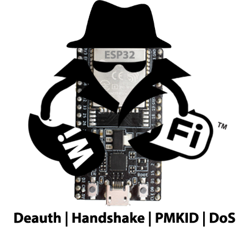
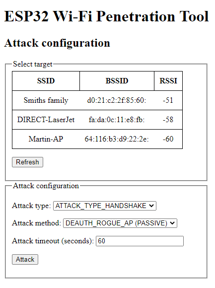

# Description

This project is a fork of "ESP32 Wi-Fi Penetration Tool" by risinek. Original repo can be found [here](https://github.com/risinek/esp32-wifi-penetration-tool). Below you can find description of original project.<br>
The goal of this fork is to make ESP32 to be more autonomous, so that you can place it near attack target, configure it and it will continue attack for a long time. Because of that this project was extended with such features as OTA, Bluetooth console, etc.

<br>

Main new features:
- OTA updates
- Bluetooth terminal
- Support of multiple devices with the same firmware
- Infinite DOS attacks
- Multi-AP DOS attacks
- Pre defined attacks per device
 
<br>

## OTA
**NOTE!** For now there is no way to track progress of OTA update. It can be implemented using WebSockets, but binary is already huge in size, so it would be better to find simpler solution to send status reports from ESP32 to WebUI.<br>
Originally Bluetooth terminal was used for triggering OTA update. But according to Espressif, when you use Bluetooth and WiFi together, they work not stable: https://docs.espressif.com/projects/esp-idf/en/latest/esp32/api-guides/coexist.html Ex. in my case when ESP's WiFi is configured as AP, I connect to it from PC and when you connect Bluetooth terminal, PC starts continuously disconnecting and connecting again. Sometimes not connecting back, etc. This is not proper connection for using OTA, so I decided not to use Bluetooth for it. I used ESP-IDF v 4.1, as suggested by risinek. If these issues are fixed in the latest ESP-IDF versions, you can try using them, but make sure WiFi attacks are still working.<br><br>
There are 2 possible ways to transfer data for OTA - using HTTP or HTTPS. For simplicity HTTP is currently used.
Before running real OTA on device, test your environment, connection, etc. Here are useful links:
- https://github.com/espressif/esp-idf/blob/master/examples/system/ota/README.md#run-https-server
- https://github.com/espressif/esp-idf/issues/5240#issuecomment-639292839

It is very important to check that port on PC, hosting OTA updates, is opened.<br>
To avoid issues with corruption of transferred images by openssl, you can create server by Python. You can use files in folder "https_test" for testing HTTP or HTTPS connections.

<br>

### HTTP

This project is already adapted for using HTTP, so no changes in sources are required.

Steps:
1. Start ESP32, conect PC to ESP's AP. Check IP address, assigned to your PC. Usually it is "192.168.4.10".
2. Copy binary you want to upload to "https_test\server"
3. Open terminal in "https_test\server" and start HTTP server by command
```
python -m http.server 8070
```
4. Open terminal in "https_test\client" and test connection by following command. Replace IP address with address of your PC in ESP32's WiFi network (refer to step 1) and name of binary file with name of your binary
```
curl -v http://192.168.4.10:8070/blink.bin -o received.file
```
5. If everything works well you will find new file "received.file" in folder "https_test\client". Make sure it has exactly the same size as the one in folder "https_test\server"

<br>

### HTTPS

First you will need to adapt sources to use HTTPS. You can refer to "simple_ota_example", which goes with ESP IDF.
In particular, you will need to
1. Place server's certificate ("ca_cert.pem") to components\ota\server_certs
2. Uncomment lines in components\ota\component.mk and components\ota\CMakeLists.txt to include certificate in ESP32's binary
3. Set configuration variable "CONFIG_OTA_ALLOW_HTTP" to "n"
4. Set "cert_pem" member of esp_http_client_config_t structure (".cert_pem = (char *)server_cert_pem_start,")
5. Anything else that I'm missing here?
<br>

Testing of connection is nearly the same as in case of HTTP. There are only 2 differences:
1. To start HTTPS server use command
```
python .\secure_server.py . ..\certs\
```
2. To test connection use following command (again, do not forget to replace IP address with yours)
```
curl -k -v https://192.168.4.10:8070/blink.bin -o received.file
```

<br>

When you made sure HTTP(S) connection works well, you can run trigger OTA update via WebUI of ESP32. For testing purposes you can use binary "https_test\server\blink.bin", which will blink LED on ESP32

<br>
<br>

## Bluetooth terminal

The main reason why Bluetooth terminal was implemented, is to have ability to reset ESP32 remotely. Ex. you are doing infinite DOS attack, ESP32 is always offering different APs and it will never be accessible via its original AP. If you don't have physical access to ESP32, you can reset it remotely using Bluetooth terminal.<br>
By default simple pairing with Bluetooth device is enabled, which doesn't require you to enter PIN code. If you do want to use PIN, then you need to set configuration variable CONFIG_BT_SSP_ENABLED to "n". Default PIN is "1234". Name of Bluetooth device is specified in "components\device_id\device_id.h" file in "gThisDeviceBTDeviceName" variable and by default is "ManagementAP1"<br>
All you need to do is just to pair ESP32 with your PC, open "Control panel", open "Devices and Printers" and check which COM port is used for your device. After that configure your terminal app (ex. Putty) to use this port at speed 9600. You can try higher speeds, if you want.<br>


<br>

## Support of multiple devices with the same firmware

It is possible to build firmware for mutiple ESP32 devices, which will run the same software. These firmwares should differ by DEVICE_ID, to make ESP32 use different WiFi access points names, Bluetooth device names, IP addresses, etc. DEVICE_ID can be set via menuconfig or in "sdkconfig" file<br>
This parameter will make your devices to have Bluetooth device name and WiFi AP name "ManagementAP<DDEVICE_ID>". IP addreses will be "192.168.4<100 + DDEVICE_ID>"<br>

<br>

## Infinite DOS attacks

For any DOS attack you can set "Overall attack duration" to 0 and make infinite attack.<br>

<br>

## Multi-AP DOS attacks

For any DOS attack you can select multiple access points (APs) and attack duration per each AP. So, having one ESP32 you can attack multiple APs one after another.

<br>

## Pre defined attacks per device

You can configure (hardcode) pre defined attack for each ESP32 device. This feature is useful if you left ESP32 device with active attack anf after some time electricity was shut down. When electricity will appear again, after specified timeout (by default - 10 min) device, based on its DEVICE_ID will start pre-defined attack.

<br>

<br><br><br>


# ESP32 Wi-Fi Penetration Tool

This project introduces an universal tool for ESP32 platform for implementing various Wi-Fi attacks. It provides some common functionality that is commonly used in Wi-Fi attacks and makes implementing new attacks a bit simpler. It also includes Wi-Fi attacks itself like capturing PMKIDs from handshakes, or handshakes themselves by different methods like starting rogue duplicated AP or sending deauthentication frames directly, etc...

Obviously cracking is not part of this project, as ESP32 is not sufficient to crack hashes in effective way. The rest can be done on this small, cheap, low-power SoC.

<p align="center">
    
</p>

## Features
- **PMKID capture**
- **WPA/WPA2 handshake capture** and parsing
- **Deauthentication attacks** using various methods
- **Denial of Service attacks**
- Formatting captured traffic into **PCAP format**
- Parsing captured handshakes into **HCCAPX file** ready to be cracked by Hashcat
- Passive handshake sniffing
- Easily extensible framework for new attacks implementations
- Management AP for easy configuration on the go using smartphone for example
- And more...

### Demo video
[](https://www.youtube.com/watch?v=9I3BxRu86GE)


## Usage
1. [Build](#Build) and [flash](#Flash) project onto ESP32 (DevKit or module)
1. Power ESP32
1. Management AP is started automatically after boot
1. Connect to this AP\
By default: 
*SSID:* `ManagementAP` and *password:* `mgmtadmin`
1. In browser open `192.168.4.1` and you should see a web client to configure and control tool like this:

    

## Build
This project is currently developed using ESP-IDF 4.1 (commit `5ef1b390026270503634ac3ec9f1ec2e364e23b2`). It may be broken on newer version.

Project can be built in the usual ESP-IDF way:

```shell
idf.py build
```

Legacy method using `make` is not supported by this project.

## Flash
If you have setup ESP-IDF, the easiest way is to use `idf.py flash`.

In case you don't want to setup whole ESP-IDF, you can use pre-build binaries included in [`build/`](build/) and flash them using [`esptool.py`](https://github.com/espressif/esptool) (requires Python).

Example command (follow instructions in [esptool repo](https://github.com/espressif/esptool)):
```
esptool.py -p /dev/ttyS5 -b 115200 --after hard_reset write_flash --flash_mode dio --flash_freq 40m --flash_size detect 0x8000 build/partition_table/partition-table.bin 0x1000 build/bootloader/bootloader.bin 0x10000 build/esp32-wifi-penetration-tool.bin
```

On Windows you can use official [Flash Download Tool](https://www.espressif.com/en/support/download/other-tools).

## Documentation
### Wi-Fi attacks
Attacks implementations in this project are described in [main component README](main/). Theory behind these attacks is located in [doc/ATTACKS_THEORY.md](doc/ATTACKS_THEORY.md)
### API reference
This project uses Doxygen notation for documenting components API and implementation. Doxyfile is included so if you want to generate API reference, just run `doxygen` from root directory. It will generate HTML API reference into `doc/api/html`.

### Components
This project consists of multiple components, that can be reused in other projects. Each component has it's own README with detailed description. Here comes brief description of components:

- [**Main**](main) component is entry point for this project. All neccessary initialisation steps are done here. Management AP is started and the control is handed to webserver.
- [**Wifi Controller**](components/wifi_controller) component wraps all Wi-Fi related operations. It's used to start AP, connect as STA, scan nearby APs etc. 
- [**Webserver**](components/webserver) component provides web UI to configure attacks. It expects that AP is started and no additional security features like SSL encryption are enabled.
- [**Wi-Fi Stack Libraries Bypasser**](components/wsl_bypasser) component bypasses Wi-Fi Stack Libraries restriction to send some types of arbitrary 802.11 frames.
- [**Frame Analyzer**](components/frame_analyzer) component processes captured frames and provides parsing functionality to other components.
- [**PCAP Serializer**](components/pcap_serializer) component serializes captured frames into PCAP binary format and provides it to other components (mostly for webserver/UI)
- [**HCCAPX Serializer**](components/hccapx_serializer) component serializes captured frames into HCCAPX binary format and provides it to other components (mostly for webserver/UI)

### Further reading
* [Academic paper about this project (PDF)](https://excel.fit.vutbr.cz/submissions/2021/048/48.pdf)

## Hardware 
This project was mostly build and tested on **ESP32-DEVKITC-32E**
but there should not be any differences for any **ESP32-WROOM-32** modules.

<p align="center">
    
</p>

On the following pictures you can see a battery (Li-Pol accumulator) powered ESP32 DevKitC using following hardware:
- **ESP32-DEVKITC-32E** (cost 213 CZK/8.2 EUR/9.6 USD)
- 220mAh Li-Pol 3.7V accumulator (weights ±5g, cost 77 CZK/3 EUR/3.5 USD)
- MCP1702-3302ET step-down 3.3V voltage regulator (cost 11 CZK/0.42 EUR/0.50 USD)
- Czech 5-koruna coin for scale (weights 4.8g, diameter 23 mm, cost 0.19 EUR/0.23 USD)
<p align="center">
    
    
</p>

Altogether (without coin) this setup weights around 17g. This can be further downsized by using smaller Li-Pol accumulator and using ESP32-WROOM-32 modul directly instead of whole dev board.

This setup cost me around 300 CZK (± 11.50 EUR/13.50 USD). Using the modul directly that costs around 80 CZK (± 3 EUR/3.5 USD) we can get to price of 160 CZK (± 6.5 EUR/7.5 USD) which makes this tool really cheap and available to almost everybody.

### Power consumption
Based on experimental measurements, ESP32 consumes around 100mA during attack executions. 

## Similar projects
* [GANESH-ICMC/esp32-deauther](https://github.com/GANESH-ICMC/esp32-deauther)
* [SpacehuhnTech/esp8266_deauther](https://github.com/SpacehuhnTech/esp8266_deauther)
* [justcallmekoko/ESP32Marauder](https://github.com/justcallmekoko/ESP32Marauder)
* [EParisot/esp32-network-toolbox](https://www.tindie.com/products/klhnikov/esp32-network-toolbox/)
* [Jeija/esp32free80211](https://github.com/Jeija/esp32free80211)

## Contributing
Feel free to contribute. Don't hestitate to refactor current code base. Please stick to Doxygen notation when commenting new functions and files. This project is mainly build for educational and demonstration purposes, so verbose documentation is welcome.

## Disclaimer
This project demonstrates vulnerabilities of Wi-Fi networks and its underlaying 802.11 standard and how ESP32 platform can be utilised to attack on those vulnerable spots. Use responsibly against networks you have permission to attack on.

## License
Even though this project is licensed under MIT license (see [LICENSE](LICENSE) file for details), don't be shy or greedy and share your work.