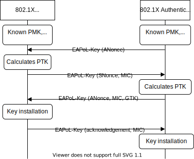
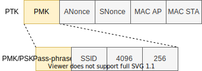
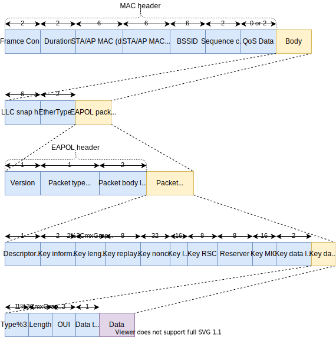
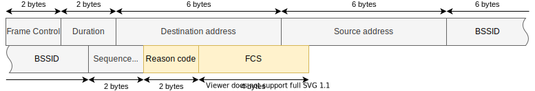

# ESP32 Wi-Fi Penetration Tool

## Handshake capture
Most common attack on WPA/WPA2-PSK (Personal) is by sniffing handshake frames and cracking PSK (Pre-Shared key, known as network password) from them. During WPA/WPA2 handshake, both sides exchange parameters that are later used to calculate same PTK (Pairwise Transient Key) on both sides. Example WPA/WPA2 handshake is demonstrated in the following picture:

PTK is used for one authenticated session and the communication is being encrypted by it (not really PTK itself, different keys are derived from PTK, but if you have PTK, you can derivate them too). Hence anyone being able to also calculate PTK can also decrypt communication between station (STA) and access point (AP). Besides these publicly transmitted parameters, there is also PMK (Pairwise Master Key) that both sides know in advance and is never transmitted. For WPA/WPA2-PSK (Personal) PMK is equal to PSK, for WPA/WPA2-Enterprise PMK is derived from MSK/AAA key (which is not covered in this writeup). PSK itself can be also split further. The *passphrase* is the actual secret that we have to figure out/crack. This is visualized in the following diagram:

*Blue cells are publicly available values that anyone reading the handshake has access to. The orange ones are the actual secrets.*

#### PTK
- **PMK** - Pairwise Master Key. Both sides knows this value in advance and is never transmitted.
- **ANonce** - AP randomly generated value
- **SNonce** - STA randomly generated value
- **MAC AP + MAC STA** - MAC addresses of AP and STA Wi-Fi network interfaces (NIC)

#### PMK/PSK
- **Passphrase** - This one is usually known as network password, passphrase, Wi-Fi password etc. This is the actual and only secret part on which whole WPA/WPA2-PSK relies. If we know this, we can calculate PTK and decrypt traffic or simply join the network, if other measures like MAC filtering is not in place.
- **SSID** - Commonly known as Wi-Fi network name. Thats the human readable (not necessarily) string you get in list of the available networks around.
- **4096** - This is the number of times the passphrase was hashed. This value is constant by design.
- **256** - Size of PSK (in bits). This value is also constant by design.

WPA/WPA2 handshake uses EAPoL protocol and its packets of EAPoL-Key type. These packets are encapsulated in 802.11 data frames. See the following frame structure breakdown:

Simplified WPA/WPA2 handshake exchange can be seen in the sequence diagram at the beginning of this writeup.

From the description above, we see that we don't actually need all four messages of WPA/WPA2 handshakes. We just need to capture all parameters and have one whole EAPoL packet with Message Integrity Code (MIC). MIC is calculated by encrypting whole EAPoL packet (with initially zeroed MIC field) using newly calculated PTK. MIC is present from second message (first message form STA). It's appended to the packet later so the counterpart can verify the message was not forged by an attacker. 

This can be used for brute-force attack by guessing the network *passphrase*, calculating PSK and PTK and then encrypting captured EAPoL-Key packet. If the result matches with MIC that was originally present in the EAPoL-Key, we found the correct PTK and passphrase.

## Deauthentication attack
One downside of handshake capture is, that you have to actually be around when some handshake with target AP is happening. This makes handshake capture unpredictable. To trigger handshake on demand, this kind of attack is usually preceded by deauthentication attack that disconnects authenticated STAs from AP,. In combination with common wireless device vendors practice that devices automatically try to reconnect themselves if they are disconnected from network without user conscience. 802.11 standard defines a process when AP or STA can send deauthentication frame to its counterpart to inform them that it doesn't will to continue on previously authenticated session. When this happens, STA that wants to continue on communication, it has to authenticate itself again.

## PMKID capture

TBD