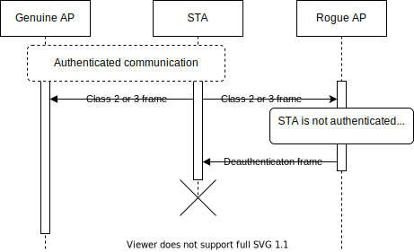

# ESP32 Wi-Fi Penetration Tool
## Main component

This component the main component (also called pseudo-component). It contains attacks implementations themselves and attack wrapper framework.

Theory behind following attacks implementations is in [/doc/ATTACK_THEORY.md](../doc/ATTACKS_THEORY.md).

### Deauth broadcast
One way to send deauthentication frames is by bypassing Wi-Fi Stack Libaries that block them from being send. For this purpose [WSL Bypasser](../components/wsl_bypasser) component is being used. For further detail about how the bypass works, see README for WSL Bypasser component.

Deauthentication frame is built with broadcast destination MAC address (ff:ff:ff:ff:ff:ff), source MAC address and BSSID of target AP.

#### Pros
- There doesn't have to be an active communication in progress. Devices will receive this frame even if they are not actively communicating.

#### Cons
- Some devices are ignoring broadcast deauthentication frames as stated in [Aircrack-ng documentation](https://www.aircrack-ng.org/doku.php?id=deauthentication#why_does_deauthentication_not_work).
    > Some clients ignore broadcast deauthentications. If this is the case, you will need to send a deauthentication directed at the particular client.

### Rogue AP
Another option is to start rogue duplicated AP. This way Wi-Fi Stack Libraries stay untouched and only ESP-IDF API is used for this. Taking in consideration that it's possible to set any valid MAC address to AP interface, we can create duplicated AP by setting same MAC as the genuine AP has by `esp_wifi_set_mac`. 
We know all necessary values from the AP scanner and have them in `wifi_ap_record_t` structure. From there we can just pass the information to `wifi_config_t` and configure AP by `esp_wifi_set_config`. Once this AP is started, whenever it receives Class 2 or 3 frame from any STA, it will respond with deauthentication frame. This behaviour is defined directly in 802.11 standard. STA has no way to verify whether the frame is from genuine AP or rogue one and in defensive manner deauthneticates itself from the network.  
This is demonstrated in the following sequence diagram: 

#### Pros
- Deauthentication frames are directed to the STA that sent some frame to AP.

#### Cons
- This apporach requires active communication to be happening.
- It may confuse STA completely so it will not be able to authenticate again, or it may try to authenticate with rogue AP instead of the genuine one. (can be fixed by turning duplicated AP on and off giving STA some time to reconnect)

### PMKID capture
To capture PMKID from AP the only thing we have to do is to initiate connection and get first handshake message from AP. If PMKID is available, AP will send it as part of the first handshake message, so it doesn't matter we don't know the credentials.

### Denial of Service 
This reuses deauthentication methods from above and just skips handshake capture. It also allows combination of all deauth methods, which makes it more robust against different behaviour of various devices.

## Reference
Doxygen API reference available